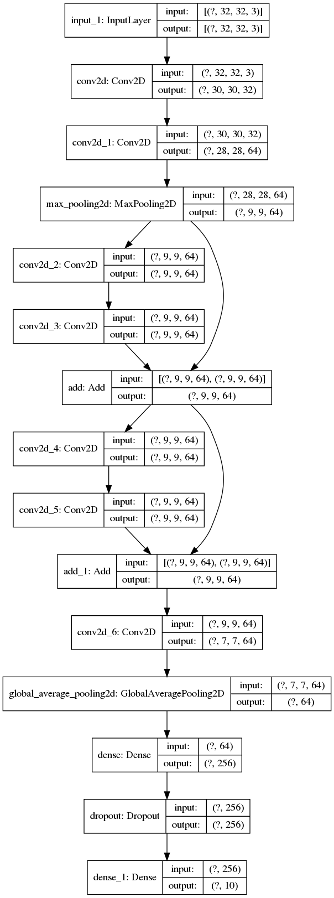
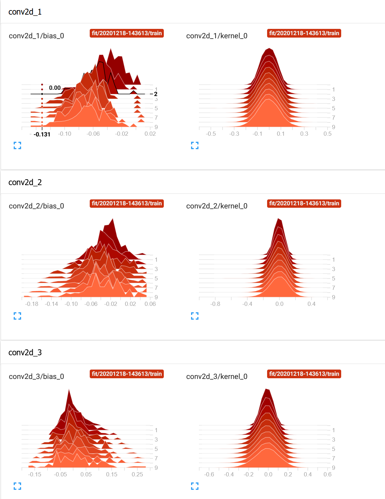
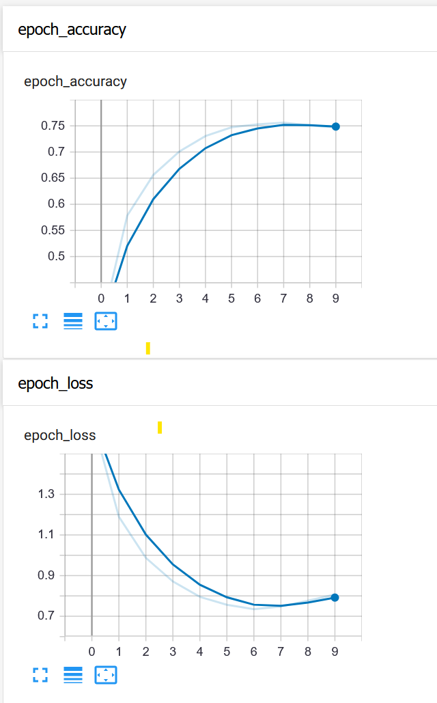

# Mini Resnet
This model was based on tensorflow tutorial of "toy renet".

Aditional features added:

* tensorboard
* callback (checkpoints)
* graphs, historgrams, scalars, etc. visualization (extend to tSNE)
* read weights and biases of each layer

## Model

## Training

Explored **relu, swish** activation funcitons.

**Dataset** used: CIFAR10, size: 50000 samples.

## Validation

With 10 epochs of training, accuracy obtained: 68.39%

## Toolchain
* python - 3.8.5
* tensorflow - 2.3.0
* cv2 - 4.1.2
* matplotlib - 3.3.2
* numpy - 1.19.2
* Used minconda or conda for virtual environment

## Tensorboard visualization

